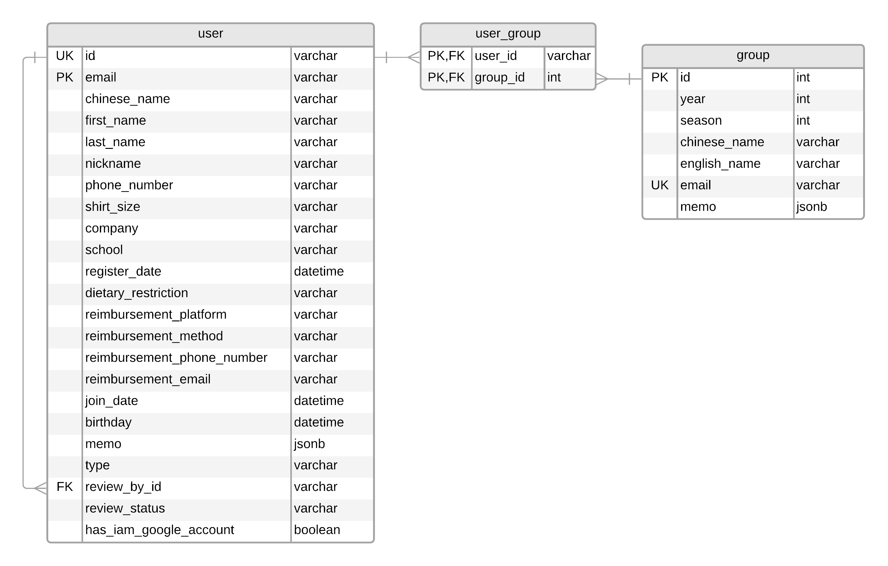

# Database Schema

## Tables

- PK: primary key
- FK: foreign key
- UK: unique
- NU: not null

### user

a user table that contain only user information.

| Column Name                | Data Type | Key Type | Not Null | Description                                                                                                          |
|----------------------------|-----------|----------|----------|----------------------------------------------------------------------------------------------------------------------|
| id                         | int       | PK       | Yes      | a unique id for the user, this key currently only use for this table. Auto-increment                                 |
| zgid                       | char      | UK       |          | a unique id use mostly for ZGZG organizatio. Generate by prefer name + last name initial + number(only if duplicate) |
| email                      | char      | PK       | Yes      | a unique email in this table. We use email as a unique user                                                          |
| chinese_name               | varchar   |          |          | a chinese name representative                                                                                        |
| first_name                 | char      |          |          | a prefer english first name                                                                                          |
| last_name                  | char      |          |          | a english last name                                                                                                  |
| nickname                   | char      |          |          | some other name want people to call a user                                                                           |
| phone_number               | char      |          |          | contact phone number                                                                                                 |
| shirt_size                 | char      |          |          | shirt size. Such XS, X, M, ...etc                                                                                    |
| company                    | varchar   |          |          | current working company                                                                                              |
| school                     | varchar   |          |          | current school or graduated school                                                                                   |
| register_date              | datetime  |          |          | a user register account date. ISO time format                                                                        |
| dietary_restriction        | varchar   |          |          | a user dietary restriction                                                                                           |
| reimbursement_platform     | char      |          |          | a user reimbursement platform, such as Paypal, or Zelle                                                              |
| reimbursement_method       | char      |          |          | reimbursement method, such as phone, or email                                                                        |
| reimbursement_phone_number | char      |          |          | reimbursement phone number                                                                                           |
| reimbursement_email        | char      |          |          | reimbursement email                                                                                                  |
| join_date                  | datetime  |          |          | a user join to organization date. ISO time format                                                                    |
| birthday                   | datetime  |          |          | a user birthday. ISO time format                                                                                     |
| memo                       | jsonb     |          |          | a note for user                                                                                                      |
| review_by                  | char      | FK       |          | a user has been review by whom. contain ZgID                                                                         |
| review_status              | char      |          |          | a review status, such as pending, approved, or deny                                                                  |
| has_zg_google_account      | boolean   |          |          | Does the user has google workspace account?                                                                          |

### group

a group may link to the google workspace group by google group email(mailing list)

| Column Name  | Data Type | Key Type | Not Null | Description                                                                         |
|--------------|-----------|----------|----------|-------------------------------------------------------------------------------------|
| id           | int       | PK       | Yes      | a unique id for a group, this key currently only use for this table. Auto-increment |
| year         | int       |          |          | a year this group belong to                                                         |
| seasion      | int       |          |          | a session for this group belong to corresponding to year                            |
| chinese_name | varchar   |          |          | chinese name for group                                                              |
| english_name | char      |          | Yes      | english name for group                                                              |
| email        | char      | UK       |          | a unique email for this group corresponding to google group                         |
| memo         | jsonb     |          |          | notes for this group                                                                |

### user_group

A many to many user group mapping table

| Column Name | Data Type | Key Type | Not Null | Description |
|-------------|-----------|----------|----------|-------------|
| user_zgid   | char      | PK, FK   | Yes      | a user zgid |
| group_id    | int       | PK, FK   | Yes      | a group id  |

### database

Contain database information such as schema version

| Column Name    | Data Type | Key Type | Not Null | Description                                |
|----------------|-----------|----------|----------|--------------------------------------------|
| schema_version | int       | PK       | Yes      | contain schema version                     |

## ER Diagram

## Reference

- table generate by [tableconvert](tableconvert.com)
- backup ER Diagram [LINK](https://lucid.app/publicSegments/view/65035835-c23a-47bd-bfc3-4e604ba177b4/image.png)
- LuciaChart [LINK](https://lucid.app/lucidchart/75c8eca5-2dcb-4634-a830-23de4aadd7fe/edit)
